# Investment Portfolio Management System

개인 투자 포트폴리오를 관리할 수 있는 웹 서비스입니다.

회원은 거래 내역과 관심 종목을 관리할 수 있으며,
관리자는 종목 등록 요청을 승인하여 종목을 추가할 수 있습니다.

Python, MySQL, Streamlit을 활용하여 CLI 버전으로 기능을 먼저 구현한 뒤 웹 서비스 형태로 확장했습니다.

## 주요 기능

### 회원

- 회원가입
- 로그인 / 로그아웃

### 거래 내역

- 거래 내역 조회
- 거래 내역 등록
- 거래 내역 삭제

### 관심 종목

- 관심 종목 조회
- 관심 종목 등록
- 관심 종목 삭제

### 종목 관리

- 등록된 종목 조회
- 종목 등록 요청
- 관리자 승인 후 종목 등록

### 통계

- 연령대별 인기 종목 조회

## Tech Stack

### Backend
- Python
- MySQL
- mysql-connector-python

### Frontend
- Streamlit

### Data Processing
- pandas 

### Version Control
- Git
- GitHub

## Database

### Tables

- MEMBER
- STOCK
- TRANSACTION_HISTORY
- WATCHLIST
- STOCK_REQUEST

### ERD
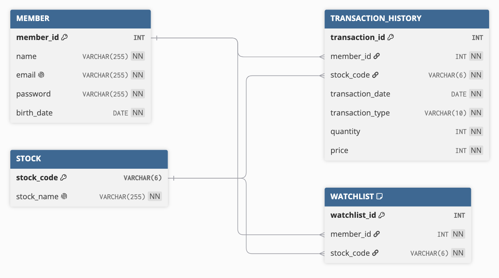

## Project Structure

```text
investment-portfolio-management-system/
│
├── python/
│   ├── app.py
│   ├── db_connection.py
│   ├── main.py
│   ├── queries.py
│   └── query_test.py
│
├── sql/
│   ├── create_tables.sql
│   ├── insert_data1.sql
│   └── select_queries.sql
│
└── README.md
```

## 실행 방법 
- 저장소 clone 

```bash
gh repo clone llucyishere/investment-portfolio-management-system
```

- 가상환경 생성 및 활성화 (선택)

```bash
python -m venv .venv
```

Windows

```bash
.venv\Scripts\activate
```

macOS / Linux

```bash
source .venv/bin/activate
```

- 필요한 라이브러리 설치 

```bash
pip install -r requirements.txt
```
- Streamlit 실행 

```bash
streamlit run python/app.py
```

## 화면 예시 
- 기본 홈 화면 
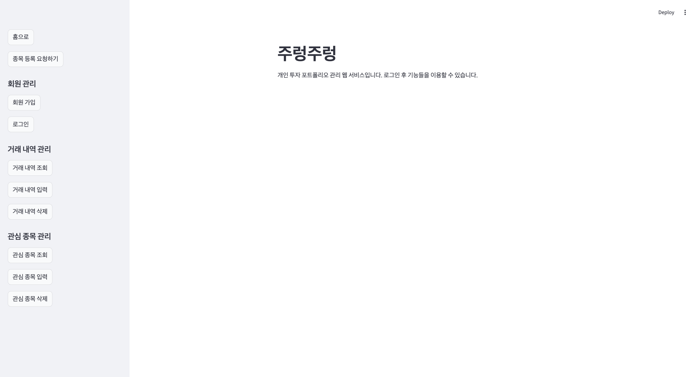
- 로그인 후 홈 화면 
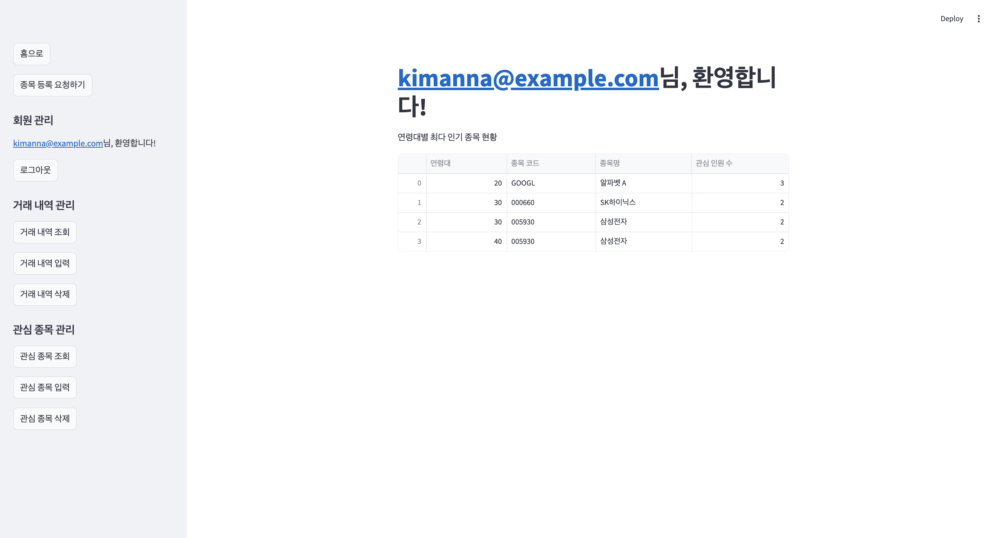

- 회원 가입 화면 
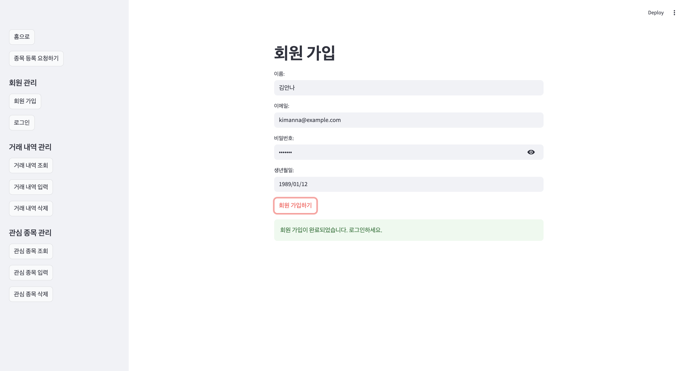
- 로그인 화면 
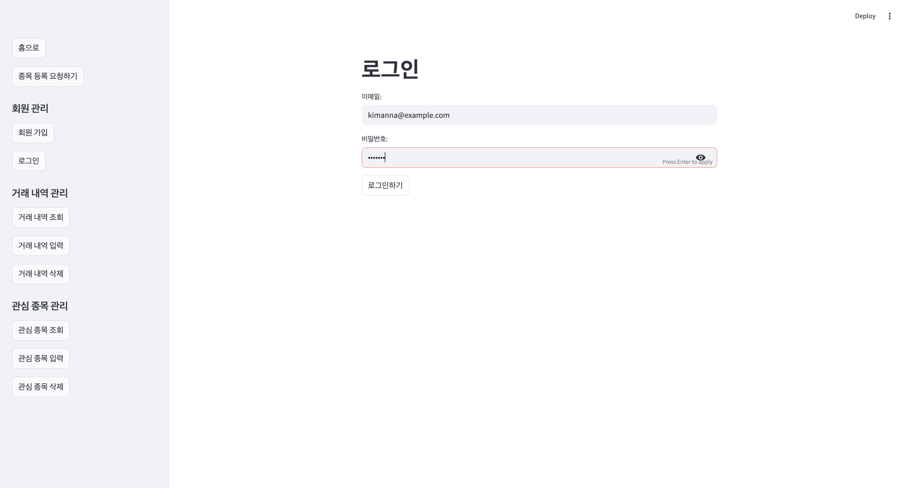

- 거래 내역 관련 화면(조회, 등록, 삭제) 
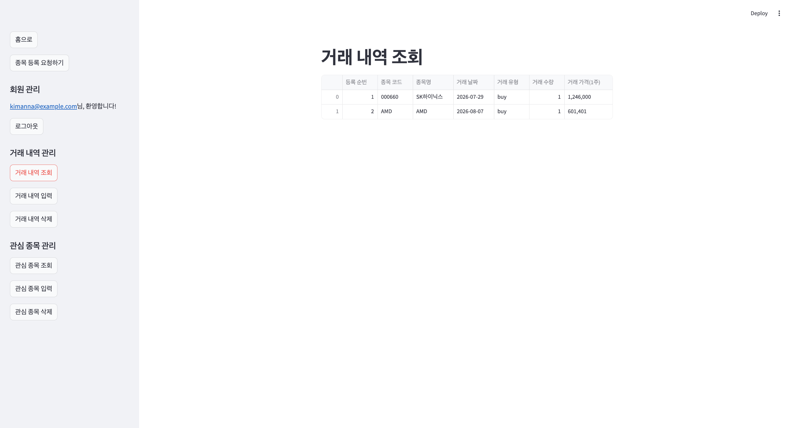
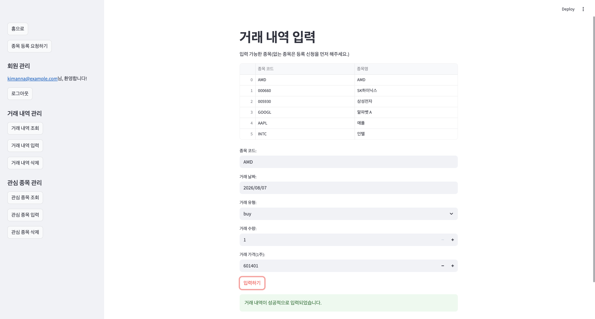
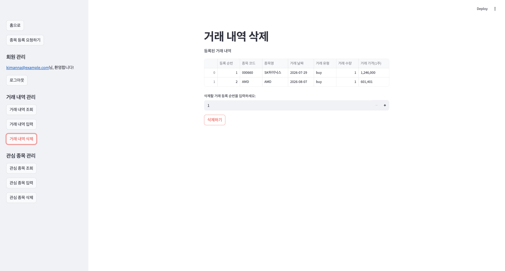

- 관심 종목 관련 화면(조회, 등록, 삭제) 
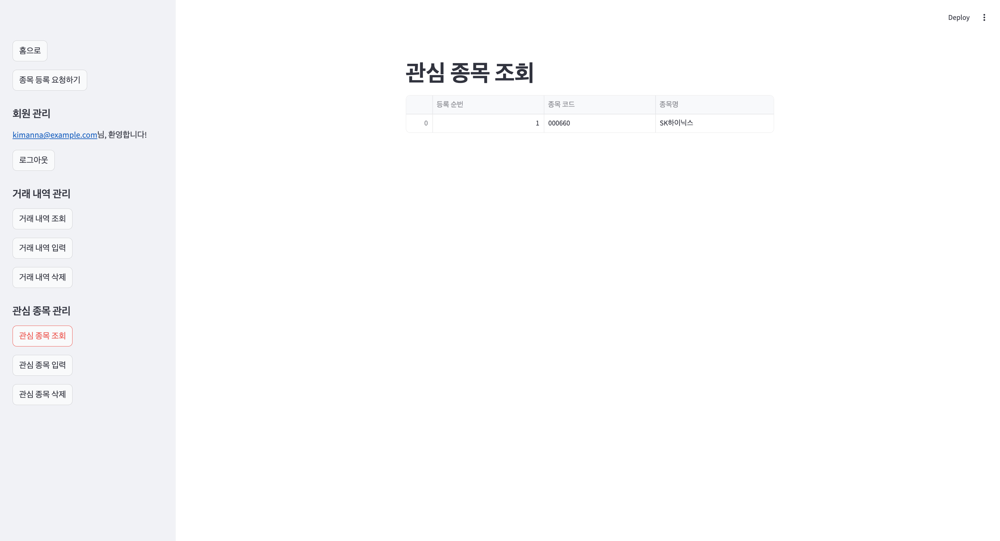
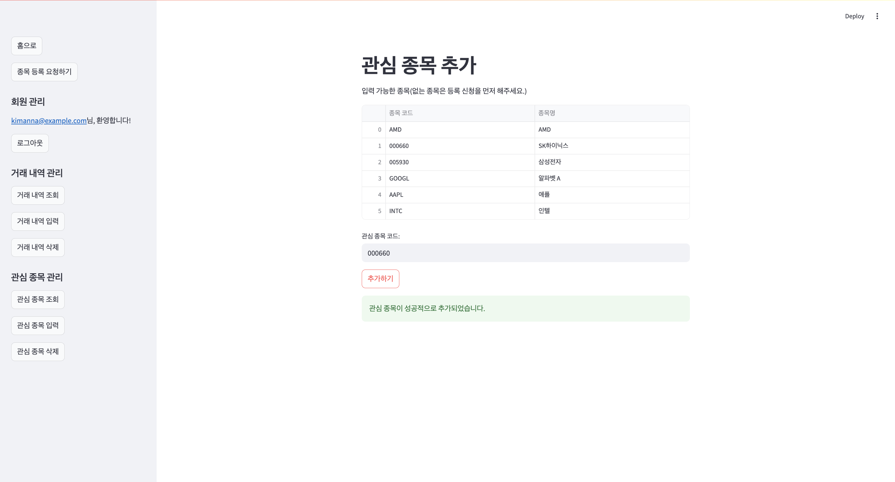
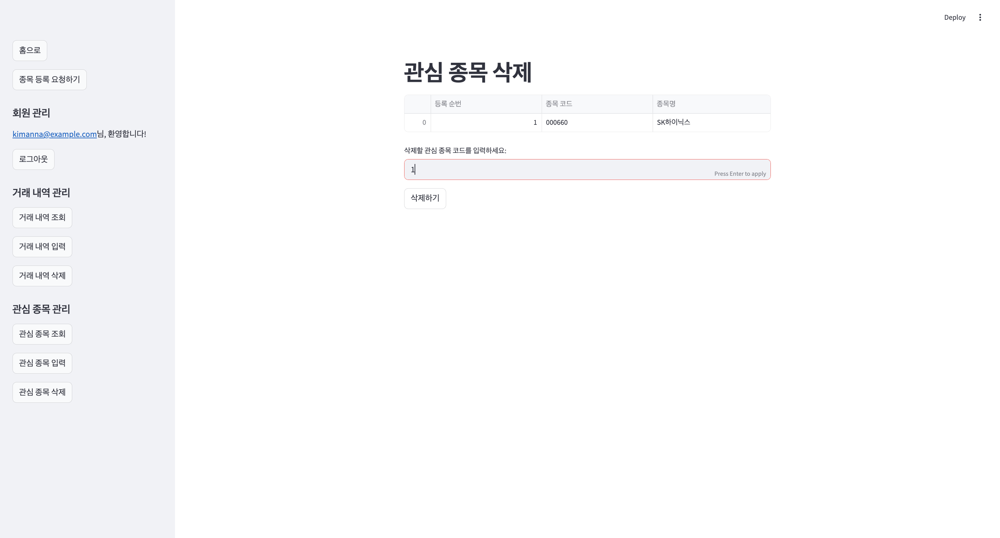

- 등록 요청 화면 
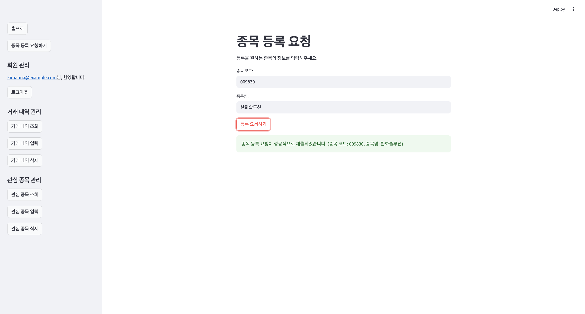
- 요청 관리 및 처리 화면 
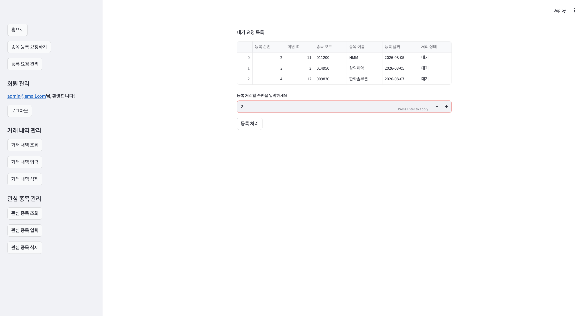

## 프로젝트 특징 
- Session State 활용 로그인 상태 관리 
- 회원별 데이터 조회 
- 관리자 권한 분리 
- 종목 등록 요청 승인 프로세스 
- SQL Window 함수 사용 연령대별 인기 종목 통계 
- CLI 버전으로 기능을 먼저 구현한 후 Streamlit을 활용해 웹UI로 확장
- Foreign Key 및 UNIQUE 제약조건을 활용한 데이터 무결성 관리 

## 추후 개선 사항 
- 비밀번호 암호화 적용 
- 전체적인 UI 개선 
- 거래 내역 수정 기능 추가 
- 검색 기능 추가(종목 및 거래 내역)
- 주가 API 연동 
- 투자 수익률 및 자산 통계 기능 추가 

## License

This project was created for educational purposes.

## 프로젝트 회고

데이터베이스 설계부터 SQL 구현, Python 연동, Streamlit을 활용한 웹 서비스 개발까지 하나의 프로젝트를 직접 구현하며 CRUD 기능과 사용자 인증, 관리자 권한 분리, 데이터 무결성 관리 과정을 경험할 수 있었습니다.